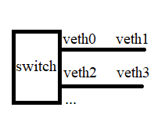

# Prerequisites

**Before you start, please make sure you have the following resources ready:** 

- Barefoot SDE P4 Studio version 9.11.2 *
- FreeRtr/RARE
- Debian 10.13.0
- Oracle VM VirtualBox 6.1

*NDA NEEDED & ALL COMMANDS IN THIS TUTORAIL ARE ONLY FOR SDE 9.11.2 

# Configure SDE VM

### 💡Configure a Virtual Environment with Barefoot SDE P4 Studio

- An SDE VM can be configured with Nix package manager by following the instructions at [https://github.com/alexandergall/bf-sde-nixpkgs](https://github.com/alexandergall/bf-sde-nixpkgs)

### Step 1: Install prerequisites

Install the Nix package manager in multi-user mode

As a regular user, execute (or download and verify the script if you don't trust the site):

```
$ bash <(curl -L https://nixos.org/nix/install) --daemon
```

and proceed as instructed. This should work on any Linux distribution because no support of the native package manager is required for the installation (except for the presence of some basic commands like `curl` or `rsync`).

### Step 2: Fetch and Verify Source Archives

Download the `bf-sde` archive for the desired version of the SDE (BF-SDE 9.11.2 in this tutorial, i.e., `bf-sde-9.11.2.tgz`) from the Intel website. BSP archive with the corresponding version is also needed (i.e. `bf-reference-bsp-9.11.2.tgz`). 

- Note that the source installation package requires Intel Academy registration and NDA. (`sha256` sums can be verified at: [https://github.com/alexandergall/bf-sde-nixpkgs#sde](https://github.com/alexandergall/bf-sde-nixpkgs#sde))

### Step 3: Add archives to the Nix store

Execute (as any user)

```bash
$ nix-store --add-fixed sha256 bf-sde-9.11.2.tgz bf-reference-bsp-9.11.2.tgz
```

- This tutorial is based on BF-SDE 9.11.2 in Debian 10.13.0 as the Linux OS for stable performance.
- A reference to download the old Debian images: [https://cdimage.debian.org/mirror/cdimage/archive/](https://cdimage.debian.org/mirror/cdimage/archive/12.0.0/amd64/iso-cd/)

### Step 4: **Clone into the Repository**

```bash
$ git clone --branch <tag> https://github.com/alexandergall/bf-sde-nixpkgs.git
$ cd bf-sde-nixpkgs
```

- v15 is used as the branch tag `<tag>` in this tutorial

### Step 5: **P4 Program Development with the SDE Shell**

To avoid the error `bash: make: command not found` make sure the prerequisites have been installed:

```jsx
sudo apt-get install build-essential jq
```

Build the environment:

```bash
$ make install VERSION=9.11.2
```

After the build has finished, the user is greeted by the SDE shell:

```
$ sde-env-9.11.2 --python-modules=yappi
[... lots of build output ...]

Intel Tofino SDE 9.11.2 on platform "model"
Compile: $ p4_build.sh <p4name>.p4
Run:     $ run_switchd.sh -p <p4name>
Run Tofino model:
         $ sudo $(type -p veth_setup.sh)
         $ run_tofino_model.sh -p <p4name>
         $ run_switchd.sh -p <p4name>
         $ sudo $(type -p veth_teardown.sh)
Run Tofino model with custom portinfo file:
         $ sudo $(type -p veth_from_portinfo) <portinfo-file>
         $ run_tofino_model.sh -p <p4name> -f <portinfo-file>
         $ run_switchd.sh -p <p4name>
         $ sudo $(type -p veth_from_portinfo) --teardown <portinfo-file>
Run PTF tests: run the Tofino model, then
         $ run_p4_tests.sh -p <p4name> -t <path-to-dir-with-test-scripts>

Build artifacts and logs are stored in /home/p4/.bf-sde/9.11.2

Use "exit" or CTRL-D to exit this shell.

[nix-shell(SDE-9.11.2):~]$
```

### Step 6: Setup the virtual interfaces for BF-SDE environment (for P4 data plane setup)

Run the bash script `veth_setup.sh` to set up the virtual interfaces: 

```bash
[nix-shell(SDE-9.11.2):~]$ veth_setup.sh
```

or

```bash
[nix-shell(SDE-9.11.2):~]$ sudo $(type -p veth_setup.sh)
```

To check whether the virtual interfaces have been set up correctly: 

```bash
[nix-shell(SDE-9.11.2):~]$ ip a
1: lo: <LOOPBACK,UP,LOWER_UP> mtu 65536 qdisc noqueue state UNKNOWN group default qlen 1000
    link/loopback 00:00:00:00:00:00 brd 00:00:00:00:00:00
    inet 127.0.0.1/8 scope host lo
       valid_lft forever preferred_lft forever
    inet6 ::1/128 scope host 
       valid_lft forever preferred_lft forever
2: eth0: <BROADCAST,MULTICAST,UP,LOWER_UP> mtu 1500 qdisc fq_codel state UP group default qlen 1000
    link/ether 08:00:27:73:60:cf brd ff:ff:ff:ff:ff:ff
    inet 10.0.2.15/24 brd 10.0.2.255 scope global dynamic eth0
       valid_lft 82493sec preferred_lft 82493sec
    inet6 fe80::a00:27ff:fe73:60cf/64 scope link 
       valid_lft forever preferred_lft forever
3: docker0: <NO-CARRIER,BROADCAST,MULTICAST,UP> mtu 1500 qdisc noqueue state DOWN group default 
    link/ether 02:42:2f:58:a6:9e brd ff:ff:ff:ff:ff:ff
    inet 172.17.0.1/16 brd 172.17.255.255 scope global docker0
       valid_lft forever preferred_lft forever
4: veth1@veth0: <BROADCAST,MULTICAST,UP,LOWER_UP> mtu 10240 qdisc noqueue state UP group default qlen 1000
    link/ether 7e:2e:20:30:08:1b brd ff:ff:ff:ff:ff:ff
5: veth0@veth1: <BROADCAST,MULTICAST,UP,LOWER_UP> mtu 10240 qdisc noqueue state UP group default qlen 1000
    link/ether 0e:a9:0e:fa:50:fd brd ff:ff:ff:ff:ff:ff
6: veth3@veth2: <BROADCAST,MULTICAST,UP,LOWER_UP> mtu 10240 qdisc noqueue state UP group default qlen 1000
    link/ether 86:ec:58:4d:e5:20 brd ff:ff:ff:ff:ff:ff
7: veth2@veth3: <BROADCAST,MULTICAST,UP,LOWER_UP> mtu 10240 qdisc noqueue state UP group default qlen 1000
    link/ether 5e:45:8a:01:76:15 brd ff:ff:ff:ff:ff:ff
8: veth5@veth4: <BROADCAST,MULTICAST,UP,LOWER_UP> mtu 10240 qdisc noqueue state UP group default qlen 1000
    link/ether 36:30:9d:53:11:99 brd ff:ff:ff:ff:ff:ff
9: veth4@veth5: <BROADCAST,MULTICAST,UP,LOWER_UP> mtu 10240 qdisc noqueue state UP group default qlen 1000
    link/ether 1a:13:57:9f:2d:b1 brd ff:ff:ff:ff:ff:ff
10: veth7@veth6: <BROADCAST,MULTICAST,UP,LOWER_UP> mtu 10240 qdisc noqueue state UP group default qlen 1000
    link/ether 62:cc:38:2c:78:e3 brd ff:ff:ff:ff:ff:ff
11: veth6@veth7: <BROADCAST,MULTICAST,UP,LOWER_UP> mtu 10240 qdisc noqueue state UP group default qlen 1000
    link/ether ca:db:ca:cc:28:35 brd ff:ff:ff:ff:ff:ff
12: veth9@veth8: <BROADCAST,MULTICAST,UP,LOWER_UP> mtu 10240 qdisc noqueue state UP group default qlen 1000
    link/ether 62:ce:7e:bd:11:04 brd ff:ff:ff:ff:ff:ff
13: veth8@veth9: <BROADCAST,MULTICAST,UP,LOWER_UP> mtu 10240 qdisc noqueue state UP group default qlen 1000
    link/ether b6:51:d5:50:64:42 brd ff:ff:ff:ff:ff:ff
14: veth11@veth10: <BROADCAST,MULTICAST,UP,LOWER_UP> mtu 10240 qdisc noqueue state UP group default qlen 1000
    link/ether 22:bc:9f:b8:36:43 brd ff:ff:ff:ff:ff:ff
15: veth10@veth11: <BROADCAST,MULTICAST,UP,LOWER_UP> mtu 10240 qdisc noqueue state UP group default qlen 1000
    link/ether 36:02:58:14:6a:a1 brd ff:ff:ff:ff:ff:ff
16: veth13@veth12: <BROADCAST,MULTICAST,UP,LOWER_UP> mtu 10240 qdisc noqueue state UP group default qlen 1000
    link/ether 96:f0:78:46:a1:5c brd ff:ff:ff:ff:ff:ff
17: veth12@veth13: <BROADCAST,MULTICAST,UP,LOWER_UP> mtu 10240 qdisc noqueue state UP group default qlen 1000
    link/ether ca:74:96:df:57:be brd ff:ff:ff:ff:ff:ff
18: veth15@veth14: <BROADCAST,MULTICAST,UP,LOWER_UP> mtu 10240 qdisc noqueue state UP group default qlen 1000
    link/ether 3a:ff:de:73:f7:4f brd ff:ff:ff:ff:ff:ff
19: veth14@veth15: <BROADCAST,MULTICAST,UP,LOWER_UP> mtu 10240 qdisc noqueue state UP group default qlen 1000
    link/ether a6:1d:3f:b0:d5:2c brd ff:ff:ff:ff:ff:ff
20: veth17@veth16: <BROADCAST,MULTICAST,UP,LOWER_UP> mtu 10240 qdisc noqueue state UP group default qlen 1000
    link/ether 86:a0:2e:c1:37:bf brd ff:ff:ff:ff:ff:ff
21: veth16@veth17: <BROADCAST,MULTICAST,UP,LOWER_UP> mtu 10240 qdisc noqueue state UP group default qlen 1000
    link/ether da:7b:18:6e:6e:f2 brd ff:ff:ff:ff:ff:ff
22: veth19@veth18: <BROADCAST,MULTICAST,UP,LOWER_UP> mtu 10240 qdisc noqueue state UP group default qlen 1000
    link/ether c6:12:64:8f:c9:dc brd ff:ff:ff:ff:ff:ff
23: veth18@veth19: <BROADCAST,MULTICAST,UP,LOWER_UP> mtu 10240 qdisc noqueue state UP group default qlen 1000
    link/ether 1e:07:86:ec:a3:e2 brd ff:ff:ff:ff:ff:ff
24: veth21@veth20: <BROADCAST,MULTICAST,UP,LOWER_UP> mtu 10240 qdisc noqueue state UP group default qlen 1000
    link/ether da:28:1d:12:d4:c2 brd ff:ff:ff:ff:ff:ff
25: veth20@veth21: <BROADCAST,MULTICAST,UP,LOWER_UP> mtu 10240 qdisc noqueue state UP group default qlen 1000
    link/ether b6:1b:40:a4:6c:0b brd ff:ff:ff:ff:ff:ff
26: veth23@veth22: <BROADCAST,MULTICAST,UP,LOWER_UP> mtu 10240 qdisc noqueue state UP group default qlen 1000
    link/ether f2:a6:23:62:fc:5a brd ff:ff:ff:ff:ff:ff
27: veth22@veth23: <BROADCAST,MULTICAST,UP,LOWER_UP> mtu 10240 qdisc noqueue state UP group default qlen 1000
    link/ether 36:d7:0a:4c:65:47 brd ff:ff:ff:ff:ff:ff
28: veth25@veth24: <BROADCAST,MULTICAST,UP,LOWER_UP> mtu 10240 qdisc noqueue state UP group default qlen 1000
    link/ether ba:c4:fb:1f:8b:c8 brd ff:ff:ff:ff:ff:ff
29: veth24@veth25: <BROADCAST,MULTICAST,UP,LOWER_UP> mtu 10240 qdisc noqueue state UP group default qlen 1000
    link/ether ce:bf:12:b2:2b:d4 brd ff:ff:ff:ff:ff:ff
30: veth27@veth26: <BROADCAST,MULTICAST,UP,LOWER_UP> mtu 10240 qdisc noqueue state UP group default qlen 1000
    link/ether f2:0f:f0:e4:25:b7 brd ff:ff:ff:ff:ff:ff
31: veth26@veth27: <BROADCAST,MULTICAST,UP,LOWER_UP> mtu 10240 qdisc noqueue state UP group default qlen 1000
    link/ether 06:3f:ef:b8:3c:bb brd ff:ff:ff:ff:ff:ff
32: veth29@veth28: <BROADCAST,MULTICAST,UP,LOWER_UP> mtu 10240 qdisc noqueue state UP group default qlen 1000
    link/ether 2a:af:3a:7f:8f:04 brd ff:ff:ff:ff:ff:ff
33: veth28@veth29: <BROADCAST,MULTICAST,UP,LOWER_UP> mtu 10240 qdisc noqueue state UP group default qlen 1000
    link/ether 4e:75:ce:f4:ee:4a brd ff:ff:ff:ff:ff:ff
34: veth31@veth30: <BROADCAST,MULTICAST,UP,LOWER_UP> mtu 10240 qdisc noqueue state UP group default qlen 1000
    link/ether 22:33:ee:73:ab:9a brd ff:ff:ff:ff:ff:ff
35: veth30@veth31: <BROADCAST,MULTICAST,UP,LOWER_UP> mtu 10240 qdisc noqueue state UP group default qlen 1000
    link/ether 12:60:26:91:ff:1f brd ff:ff:ff:ff:ff:ff
36: veth33@veth32: <BROADCAST,MULTICAST,UP,LOWER_UP> mtu 10240 qdisc noqueue state UP group default qlen 1000
    link/ether ba:6c:97:44:80:7c brd ff:ff:ff:ff:ff:ff
37: veth32@veth33: <BROADCAST,MULTICAST,UP,LOWER_UP> mtu 10240 qdisc noqueue state UP group default qlen 1000
    link/ether 46:00:56:29:50:f8 brd ff:ff:ff:ff:ff:ff
38: veth35@veth34: <BROADCAST,MULTICAST,UP,LOWER_UP> mtu 10240 qdisc noqueue state UP group default qlen 1000
    link/ether c2:7b:46:3a:0c:db brd ff:ff:ff:ff:ff:ff
39: veth34@veth35: <BROADCAST,MULTICAST,UP,LOWER_UP> mtu 10240 qdisc noqueue state UP group default qlen 1000
    link/ether b6:93:10:84:9d:72 brd ff:ff:ff:ff:ff:ff
40: veth37@veth36: <BROADCAST,MULTICAST,UP,LOWER_UP> mtu 10240 qdisc noqueue state UP group default qlen 1000
    link/ether 0e:e3:1e:79:e8:6a brd ff:ff:ff:ff:ff:ff
41: veth36@veth37: <BROADCAST,MULTICAST,UP,LOWER_UP> mtu 10240 qdisc noqueue state UP group default qlen 1000
    link/ether 06:d4:c0:00:a3:6f brd ff:ff:ff:ff:ff:ff
42: veth39@veth38: <BROADCAST,MULTICAST,UP,LOWER_UP> mtu 10240 qdisc noqueue state UP group default qlen 1000
    link/ether be:86:e7:c2:f7:cd brd ff:ff:ff:ff:ff:ff
43: veth38@veth39: <BROADCAST,MULTICAST,UP,LOWER_UP> mtu 10240 qdisc noqueue state UP group default qlen 1000
    link/ether 2e:f1:1d:84:85:d9 brd ff:ff:ff:ff:ff:ff
44: veth41@veth40: <BROADCAST,MULTICAST,UP,LOWER_UP> mtu 10240 qdisc noqueue state UP group default qlen 1000
    link/ether c6:af:11:82:7a:d2 brd ff:ff:ff:ff:ff:ff
45: veth40@veth41: <BROADCAST,MULTICAST,UP,LOWER_UP> mtu 10240 qdisc noqueue state UP group default qlen 1000
    link/ether 4e:bf:e9:48:09:cb brd ff:ff:ff:ff:ff:ff
46: veth43@veth42: <BROADCAST,MULTICAST,UP,LOWER_UP> mtu 10240 qdisc noqueue state UP group default qlen 1000
    link/ether 72:8f:39:47:6d:40 brd ff:ff:ff:ff:ff:ff
47: veth42@veth43: <BROADCAST,MULTICAST,UP,LOWER_UP> mtu 10240 qdisc noqueue state UP group default qlen 1000
    link/ether 3e:96:c3:01:19:13 brd ff:ff:ff:ff:ff:ff
48: veth45@veth44: <BROADCAST,MULTICAST,UP,LOWER_UP> mtu 10240 qdisc noqueue state UP group default qlen 1000
    link/ether 36:8e:c5:46:e6:03 brd ff:ff:ff:ff:ff:ff
49: veth44@veth45: <BROADCAST,MULTICAST,UP,LOWER_UP> mtu 10240 qdisc noqueue state UP group default qlen 1000
    link/ether e6:f2:ca:92:f3:48 brd ff:ff:ff:ff:ff:ff
50: veth47@veth46: <BROADCAST,MULTICAST,UP,LOWER_UP> mtu 10240 qdisc noqueue state UP group default qlen 1000
    link/ether aa:28:b5:68:36:f0 brd ff:ff:ff:ff:ff:ff
51: veth46@veth47: <BROADCAST,MULTICAST,UP,LOWER_UP> mtu 10240 qdisc noqueue state UP group default qlen 1000
    link/ether 76:e3:24:ff:45:0e brd ff:ff:ff:ff:ff:ff
52: veth49@veth48: <BROADCAST,MULTICAST,UP,LOWER_UP> mtu 10240 qdisc noqueue state UP group default qlen 1000
    link/ether b6:4a:d6:dc:0f:01 brd ff:ff:ff:ff:ff:ff
53: veth48@veth49: <BROADCAST,MULTICAST,UP,LOWER_UP> mtu 10240 qdisc noqueue state UP group default qlen 1000
    link/ether 7a:71:0e:e8:6d:92 brd ff:ff:ff:ff:ff:ff
54: veth51@veth50: <BROADCAST,MULTICAST,UP,LOWER_UP> mtu 10240 qdisc noqueue state UP group default qlen 1000
    link/ether 8a:60:17:b2:97:88 brd ff:ff:ff:ff:ff:ff
55: veth50@veth51: <BROADCAST,MULTICAST,UP,LOWER_UP> mtu 10240 qdisc noqueue state UP group default qlen 1000
    link/ether ce:da:79:af:6b:b8 brd ff:ff:ff:ff:ff:ff
56: veth53@veth52: <BROADCAST,MULTICAST,UP,LOWER_UP> mtu 10240 qdisc noqueue state UP group default qlen 1000
    link/ether 8e:2a:2c:4e:be:d0 brd ff:ff:ff:ff:ff:ff
57: veth52@veth53: <BROADCAST,MULTICAST,UP,LOWER_UP> mtu 10240 qdisc noqueue state UP group default qlen 1000
    link/ether da:f2:e4:54:8c:2d brd ff:ff:ff:ff:ff:ff
58: veth55@veth54: <BROADCAST,MULTICAST,UP,LOWER_UP> mtu 10240 qdisc noqueue state UP group default qlen 1000
    link/ether fe:e2:e9:a1:d5:2a brd ff:ff:ff:ff:ff:ff
59: veth54@veth55: <BROADCAST,MULTICAST,UP,LOWER_UP> mtu 10240 qdisc noqueue state UP group default qlen 1000
    link/ether a6:c1:b4:e8:ad:41 brd ff:ff:ff:ff:ff:ff
60: veth57@veth56: <BROADCAST,MULTICAST,UP,LOWER_UP> mtu 10240 qdisc noqueue state UP group default qlen 1000
    link/ether ca:23:e6:69:e4:77 brd ff:ff:ff:ff:ff:ff
61: veth56@veth57: <BROADCAST,MULTICAST,UP,LOWER_UP> mtu 10240 qdisc noqueue state UP group default qlen 1000
    link/ether 5a:27:f8:7c:cf:bf brd ff:ff:ff:ff:ff:ff
62: veth59@veth58: <BROADCAST,MULTICAST,UP,LOWER_UP> mtu 10240 qdisc noqueue state UP group default qlen 1000
    link/ether 1e:18:d8:1f:5d:cb brd ff:ff:ff:ff:ff:ff
63: veth58@veth59: <BROADCAST,MULTICAST,UP,LOWER_UP> mtu 10240 qdisc noqueue state UP group default qlen 1000
    link/ether 86:47:d0:0e:f0:a8 brd ff:ff:ff:ff:ff:ff
64: veth61@veth60: <BROADCAST,MULTICAST,UP,LOWER_UP> mtu 10240 qdisc noqueue state UP group default qlen 1000
    link/ether e2:b9:6a:c4:3d:35 brd ff:ff:ff:ff:ff:ff
65: veth60@veth61: <BROADCAST,MULTICAST,UP,LOWER_UP> mtu 10240 qdisc noqueue state UP group default qlen 1000
    link/ether c6:06:76:c6:2f:6f brd ff:ff:ff:ff:ff:ff
66: veth63@veth62: <BROADCAST,MULTICAST,UP,LOWER_UP> mtu 10240 qdisc noqueue state UP group default qlen 1000
    link/ether 96:d0:51:36:17:25 brd ff:ff:ff:ff:ff:ff
67: veth62@veth63: <BROADCAST,MULTICAST,UP,LOWER_UP> mtu 10240 qdisc noqueue state UP group default qlen 1000
    link/ether ea:bf:5f:1b:4b:1b brd ff:ff:ff:ff:ff:ff
68: veth251@veth250: <BROADCAST,MULTICAST,UP,LOWER_UP> mtu 10240 qdisc noqueue state UP group default qlen 1000
    link/ether fe:e5:15:42:8a:81 brd ff:ff:ff:ff:ff:ff
69: veth250@veth251: <BROADCAST,MULTICAST,UP,LOWER_UP> mtu 10240 qdisc noqueue state UP group default qlen 1000
    link/ether ee:8a:51:9b:7e:64 brd ff:ff:ff:ff:ff:ff
```

The mapping of the virtual interfaces follows the pattern: 



