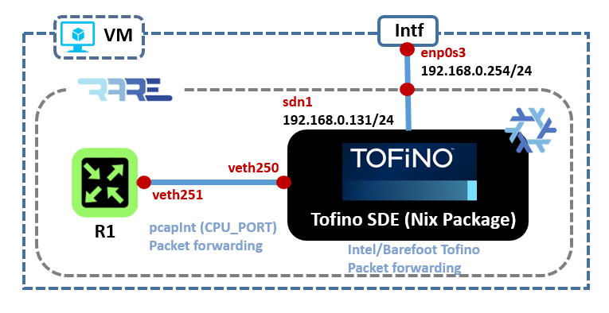
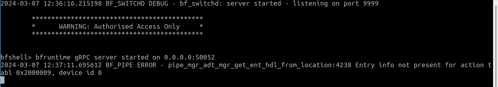

# Run RARE with TOFINO P4 data plane

In a new SDE terminal, run TOFINO model with `bf_router` as program and log file (if any) should be in `~/rare-run/logs`: 

```bash
[nix-shell(SDE-9.11.2):~]$ run_tofino_model.sh —arch tf1 -p bf_router -f ~/rare-run/etc/ports.json --log-dir ~/rare-run/logs/ -q
Using SDE /nix/store/5c2aj8c42hav152y2vh6nd4nmxkyza6h-bf-sde-model-env-9.11.2
Using SDE_INSTALL /nix/store/5c2aj8c42hav152y2vh6nd4nmxkyza6h-bf-sde-model-env-9.11.2
Model using test directory: 
Model using port info file: None
Using PATH /nix/store/5c2aj8c42hav152y2vh6nd4nmxkyza6h-bf-sde-model-env-9.11.2/bin:/nix/store/ahkfdxq8mcpsb5kvdvgqr1wv8zjngbh4-coreutils-9.1/bin:/nix/store/lkpnvz1qjbl3da38gdd8gx26sx9hfkqg-util-linux-2.38.1-bin/bin:/nix/store/4qrbfa42xyicny7vlgbbqxz07kcsjbx2-findutils-4.9.0/bin:/usr/bin
Using LD_LIBRARY_PATH /nix/store/5c2aj8c42hav152y2vh6nd4nmxkyza6h-bf-sde-model-env-9.11.2/lib::/usr/local/lib
 PRIVS: Eff=0x00000000 Perm=0x00002006 Inh=0x00000000
Performing preliminary checks on config file
Opening p4 target config file '/home/p4/.bf-sde/9.11.2/share/p4/targets/tofino/bf_router.conf' ...
Loaded p4 target config file
 Package size 1
 No of Chips is 1
Chip part revision number is 1
 No of Packages is 1
Chip 0 SKU: defaulting to BFN77110
Chip 0 SKU setting: sku 0 pipe mode 0
Chip 0 Physical pipes enabled bitmap 0xf 
Adding interface veth0 as port 0
Adding interface veth2 as port 1
Adding interface veth4 as port 2
Adding interface veth6 as port 3
Adding interface veth8 as port 4
Adding interface veth10 as port 5
Adding interface veth12 as port 6
Adding interface veth14 as port 7
Adding interface veth16 as port 8
Adding interface veth18 as port 9
Adding interface veth20 as port 10
Adding interface veth22 as port 11
Adding interface veth24 as port 12
Adding interface veth26 as port 13
Adding interface veth28 as port 14
Adding interface veth30 as port 15
Adding interface veth32 as port 16
Adding interface veth250 as port 64
Simulation target: Asic Model
Using TCP port range: 8001-8004
Listen socket created
bind done on port 8001. Listening..
Waiting for incoming connections...
CLI listening on port 8000
Connection accepted on port 8001
Client socket created
Connected on port 8002
INFO: DRU sim MTI initialized successfully
 EFUSE:Idx 0, sku 0, pipe_mode is 0, pipes_en_bmp 0xf, model-val 0x0 
Tofino Verification Model - Version 83c7cba-dirty
Created 1 packet processing threads
:-:-:<0,-,0>:Waiting for packets to process
LOGS captured in: ./model_20231103_083655.log
:11-03 08:40:30.836806:    Setting logging fn
LOGS captured in: ./model_20231103_083655.log
:11-03 08:40:30.836864:    PORT UP asic 0 port 0
:11-03 08:40:30.836921:    Registering handler for tx
Opening p4 target config file '/home/p4/.bf-sde/9.11.2/share/p4/targets/tofino/bf_router.conf' ...
:11-03 08:40:30.836951:    PORT UP asic 0 port 1
:11-03 08:40:30.837120:    PORT UP asic 0 port 2
Loaded p4 target config file
Device 0: Pipe 0: loading P4 name lookup file /home/p4/.bf-sde/9.11.2/share/tofinopd/bf_router/pipe/context.json found in /home/p4/.bf-sde/9.11.2/share/p4/targets/tofino/bf_router.conf
Opening context file '/home/p4/.bf-sde/9.11.2/share/tofinopd/bf_router/pipe/context.json' ...
:11-03 08:40:30.837176:    PORT UP asic 0 port 3
:11-03 08:40:30.837198:    PORT UP asic 0 port 4
:11-03 08:40:30.837266:    PORT UP asic 0 port 5
:11-03 08:40:30.837284:    PORT UP asic 0 port 6
:11-03 08:40:30.837300:    PORT UP asic 0 port 7
:11-03 08:40:30.837344:    PORT UP asic 0 port 8
:11-03 08:40:30.837380:    PORT UP asic 0 port 9
:11-03 08:40:30.837433:    PORT UP asic 0 port 10
:11-03 08:40:30.837478:    PORT UP asic 0 port 11
:11-03 08:40:30.837524:    PORT UP asic 0 port 12
:11-03 08:40:30.837570:    PORT UP asic 0 port 13
:11-03 08:40:30.837606:    PORT UP asic 0 port 14
:11-03 08:40:30.837661:    PORT UP asic 0 port 15
:11-03 08:40:30.837707:    PORT UP asic 0 port 16
:11-03 08:40:30.837744:    PORT UP asic 0 port 64
Loaded context file
Device 0: Pipe 1: loading P4 name lookup file /home/p4/.bf-sde/9.11.2/share/tofinopd/bf_router/pipe/context.json found in /home/p4/.bf-sde/9.11.2/share/p4/targets/tofino/bf_router.conf
Opening context file '/home/p4/.bf-sde/9.11.2/share/tofinopd/bf_router/pipe/context.json' ...
Loaded context file
Device 0: Pipe 2: loading P4 name lookup file /home/p4/.bf-sde/9.11.2/share/tofinopd/bf_router/pipe/context.json found in /home/p4/.bf-sde/9.11.2/share/p4/targets/tofino/bf_router.conf
Opening context file '/home/p4/.bf-sde/9.11.2/share/tofinopd/bf_router/pipe/context.json' ...
Loaded context file
Device 0: Pipe 3: loading P4 name lookup file /home/p4/.bf-sde/9.11.2/share/tofinopd/bf_router/pipe/context.json found in /home/p4/.bf-sde/9.11.2/share/p4/targets/tofino/bf_router.conf
Opening context file '/home/p4/.bf-sde/9.11.2/share/tofinopd/bf_router/pipe/context.json' ...
Loaded context file
:11-03 08:40:30.941604:     Updating model log flags: clearing 0xffffffff ffffffff, setting 0x00000000 0000000f
:11-03 08:40:30.945865:    :-:-:<0,0,0>:Updating p4 log flags: clearing 0xffffffff ffffffff, setting 0x00000000 0000007f
:11-03 08:40:30.949395:    :-:-:<0,0,0>:Updating tofino log flags: clearing 0xffffffff ffffffff, setting 0x00000000 0000007f
:11-03 08:40:30.952823:    :-:-:<0,0,0>:Updating packet log flags: clearing 0xffffffff ffffffff, setting 0x00000000 0000007f
Dropping excess privileges...
```

Run bf_switchd (logs will be in `~/rare-run/logs`):

```bash
[nix-shell(SDE-9.11.2):~]$ run_switchd.sh -p bf_router
Using SDE /nix/store/5c2aj8c42hav152y2vh6nd4nmxkyza6h-bf-sde-model-env-9.11.2
Using SDE_INSTALL /nix/store/5c2aj8c42hav152y2vh6nd4nmxkyza6h-bf-sde-model-env-9.11.2
Setting up DMA Memory Pool
Using TARGET_CONFIG_FILE /home/p4/.bf-sde/9.11.2/share/p4/targets/tofino/bf_router.conf
Using PATH /nix/store/5c2aj8c42hav152y2vh6nd4nmxkyza6h-bf-sde-model-env-9.11.2/bin:/nix/store/ahkfdxq8mcpsb5kvdvgqr1wv8zjngbh4-coreutils-9.1/bin:/nix/store/lkpnvz1qjbl3da38gdd8gx26sx9hfkqg-util-linux-2.38.1-bin/bin:/nix/store/4qrbfa42xyicny7vlgbbqxz07kcsjbx2-findutils-4.9.0/bin:/nix/store/zrls4w5lxynqakh1jlrp03kg4bxzp9yi-gnugrep-3.7/bin:/nix/store/gy82r5cf12hgkmhzifsyx3fp6cnf6j2l-gnused-4.9/bin:/nix/store/pi05gf5p4p1p1j41p12sha27zgjfs767-procps-3.3.17/bin:/nix/store/rhvbjmcfnkg8i2dxpzr114cp1ws7f667-bash-5.2-p15/bin
Using LD_LIBRARY_PATH /nix/store/5c2aj8c42hav152y2vh6nd4nmxkyza6h-bf-sde-model-env-9.11.2/lib::/usr/local/lib
2023-11-03 08:40:29.161395 BF_SWITCHD DEBUG - bf_switchd: system services initialized
2023-11-03 08:40:29.184829 BF_SWITCHD DEBUG - bf_switchd: loading conf_file /home/p4/.bf-sde/9.11.2/share/p4/targets/tofino/bf_router.conf...
2023-11-03 08:40:29.184877 BF_SWITCHD DEBUG - bf_switchd: processing device configuration...
2023-11-03 08:40:29.184919 BF_SWITCHD DEBUG - Configuration for dev_id 0
2023-11-03 08:40:29.184932 BF_SWITCHD DEBUG -   Family        : tofino
2023-11-03 08:40:29.184938 BF_SWITCHD DEBUG -   pci_sysfs_str : /sys/devices/pci0000:00/0000:00:03.0/0000:05:00.0
2023-11-03 08:40:29.184944 BF_SWITCHD DEBUG -   pci_int_mode  : 0
2023-11-03 08:40:29.184949 BF_SWITCHD DEBUG -   sds_fw_path   : share/tofino_sds_fw/avago/firmware
2023-11-03 08:40:29.184955 BF_SWITCHD DEBUG - bf_switchd: processing P4 configuration...
2023-11-03 08:40:29.184993 BF_SWITCHD DEBUG - P4 profile for dev_id 0
2023-11-03 08:40:29.185000 BF_SWITCHD DEBUG - num P4 programs 1
2023-11-03 08:40:29.185006 BF_SWITCHD DEBUG -   p4_name: bf_router
2023-11-03 08:40:29.185013 BF_SWITCHD DEBUG -   p4_pipeline_name: pipe
2023-11-03 08:40:29.185022 BF_SWITCHD DEBUG -     libpd: 
2023-11-03 08:40:29.185027 BF_SWITCHD DEBUG -     libpdthrift: 
2023-11-03 08:40:29.185033 BF_SWITCHD DEBUG -     context: /home/p4/.bf-sde/9.11.2/share/tofinopd/bf_router/pipe/context.json
2023-11-03 08:40:29.185039 BF_SWITCHD DEBUG -     config: /home/p4/.bf-sde/9.11.2/share/tofinopd/bf_router/pipe/tofino.bin
2023-11-03 08:40:29.185049 BF_SWITCHD DEBUG -   Pipes in scope [
2023-11-03 08:40:29.185054 BF_SWITCHD DEBUG - 0 
2023-11-03 08:40:29.185062 BF_SWITCHD DEBUG - 1 
2023-11-03 08:40:29.185067 BF_SWITCHD DEBUG - 2 
2023-11-03 08:40:29.185075 BF_SWITCHD DEBUG - 3 
2023-11-03 08:40:29.185082 BF_SWITCHD DEBUG - ]
2023-11-03 08:40:29.185095 BF_SWITCHD DEBUG -   diag: 
2023-11-03 08:40:29.185101 BF_SWITCHD DEBUG -   accton diag: 
2023-11-03 08:40:29.185106 BF_SWITCHD DEBUG -   Agent[0]: /nix/store/5c2aj8c42hav152y2vh6nd4nmxkyza6h-bf-sde-model-env-9.11.2/lib/libpltfm_mgr.so
2023-11-03 08:40:29.216314 BF_SWITCHD DEBUG - bf_switchd: library /nix/store/5c2aj8c42hav152y2vh6nd4nmxkyza6h-bf-sde-model-env-9.11.2/lib/libpltfm_mgr.so loaded
2023-11-03 08:40:29.216915 BF_SWITCHD DEBUG - bf_switchd: agent[0] initialized
2023-11-03 08:40:29.219420 BF_SWITCHD DEBUG - Device 0: Operational mode set to MODEL
2023-11-03 08:40:29.219574 BF_SWITCHD DEBUG - Initialized the device types using platforms infra API
Starting PD-API RPC server on port 9090
2023-11-03 08:40:29.224612 BF_SWITCHD DEBUG - bf_switchd: drivers initialized
2023-11-03 08:40:29.224652 BF_SWITCHD DEBUG - bf_switchd: initializing dru_sim service
2023-11-03 08:40:29.224967 BF_SWITCHD DEBUG - bf_switchd: library libdru_sim.so loaded
INFO: DRU sim MTI initialized successfully
dru_sim: client socket created
dru_sim: connected on port 8001
dru_sim: listen socket created
dru_sim: bind done on port 8002, listening...
dru_sim: waiting for incoming connections...
dru_sim: connection accepted on port 8002
dru_sim: DRU simulator running
Setting core_pll_ctrl0=cd44cbfe
/2023-11-03 08:40:52.242339 BF_SWITCHD DEBUG - bf_switchd: dev_id 0 initialized
2023-11-03 08:40:52.242384 BF_SWITCHD DEBUG - bf_switchd: initialized 1 devices
Adding Thrift service for bf-platforms to server
2023-11-03 08:40:52.242793 BF_SWITCHD DEBUG - bf_switchd: thrift initialized for agent : 0
2023-11-03 08:40:52.242909 BF_SWITCHD DEBUG - bf_switchd: spawning cli server thread
2023-11-03 08:40:52.540249 BF_SWITCHD DEBUG - bf_switchd: spawning driver shell
2023-11-03 08:40:52.540429 BF_SWITCHD DEBUG - bf_switchd: server started - listening on port 9999
bfruntime gRPC server started on 0.0.0.0:50052

        ********************************************
        *      WARNING: Authorised Access Only     *
        ********************************************
    

bfshell>
```

# Verification

* Based on the documentation: [https://wiki.geant.org/pages/viewpage.action?pageId=148084243](https://wiki.geant.org/pages/viewpage.action?pageId=148084243)



### Step1: Launch the forwarding configuration in RARE

Launch RARE `bf_forwarder.p4` (BfRuntime GRPC based interface)

```bash
[nix-shell(SDE-9.11.2):~]$ cd rare/bfrt_python/
[nix-shell(SDE-9.11.2):~/rare/bfrt_python/]$ python3 bf_forwarder.py --ifmibs-dir ~/rare-run/mibs/ --ifindex ~/rare-run/snmp/ifindex
bf_forwarder.py running on: MODEL
GRPC_ADDRESS: 127.0.0.1:50052
P4_NAME: bf_router
CLIENT_ID: 0
Subscribe attempt #1
Subscribe response received 0
Received bf_router on GetForwarding
Binding with p4_name bf_router
Binding with p4_name bf_router successful!!
BfForwarder - loop
  Clearing Table pipe.ig_ctl.ig_ctl_mpls.tbl_mpls_fib
  Clearing Table pipe.ig_ctl.ig_ctl_acl_in.tbl_ipv6_acl
BfIfSnmpClient - main
BfIfSnmpClient - No active ports
  Clearing Table pipe.ig_ctl.ig_ctl_ipv4.tbl_ipv4_fib_host
  Clearing Table pipe.ig_ctl.ig_ctl_copp.tbl_ipv6_copp
  Clearing Table pipe.ig_ctl.ig_ctl_acl_in.tbl_ipv4_acl
  Clearing Table pipe.ig_ctl.ig_ctl_ipv6.tbl_ipv6_fib_host
  Clearing Table pipe.ig_ctl.ig_ctl_mpls.tbl_mpls_fib_decap
  Clearing Table pipe.ig_ctl.ig_ctl_nexthop.tbl_nexthop
  Clearing Table pipe.ig_ctl.ig_ctl_vlan_out.tbl_vlan_out
  Clearing Table pipe.ig_ctl.ig_ctl_vlan_in.tbl_vlan_in
  Clearing Table pipe.ig_ctl.ig_ctl_acl_out.tbl_ipv6_acl
  Clearing Table pipe.ig_ctl.ig_ctl_ipv4.tbl_ipv4_fib_lpm
  Clearing Table pipe.ig_ctl.ig_ctl_acl_out.tbl_ipv4_acl
  Clearing Table pipe.ig_ctl.ig_ctl_vrf.tbl_vrf
  Clearing Table pipe.ig_ctl.ig_ctl_copp.tbl_ipv4_copp
  Clearing Table pipe.ig_ctl.ig_ctl_ipv6.tbl_ipv6_fib_lpm
  Clearing Table pipe.ig_ctl.ig_ctl_bridge.tbl_bridge_target
  Clearing Table pipe.ig_ctl.ig_ctl_bridge.tbl_bridge_learn
Bundle specific clearing: (Order matters)
  Clearing Bundle Table pipe.ig_ctl.ig_ctl_bundle.tbl_nexthop_bundle
  Clearing Bundle Table pipe.ig_ctl.ig_ctl_bundle.ase_bundle
  Clearing Bundle Table pipe.ig_ctl.ig_ctl_bundle.apr_bundle
BfForwarder - Main
BfForwarder - Entering message loop
rx: ['myaddr4_add', '224.0.0.0/4', '0', '1', '\n']
BfIfStatus - main
BfIfStatus - No active ports
rx: ['myaddr4_add', '255.255.255.255/32', '0', '1', '\n']
BfSubIfCounter - main
BfSubIfCounter - No active ports
rx: ['myaddr6_add', 'ff00::/8', '0', '1', '\n']
rx: ['myaddr4_add', '192.168.0.0/24', '-1', '1', '\n']
rx: ['myaddr4_add', '192.168.0.131/32', '-1', '1', '\n']
rx: ['myaddr6_add', '2a01:e0a:159:2850::/64', '-1', '1', '\n']
rx: ['myaddr6_add', '2a01:e0a:159:2850::666/128', '-1', '1', '\n']
rx: ['myaddr6_add', 'fe80::/64', '-1', '1', '\n']
rx: ['mylabel4_add', '186286', '1', '\n']
rx: ['mylabel6_add', '842368', '1', '\n']
rx: ['state', '0', '1', '10', '\n']
rx: ['mtu', '0', '9000', '\n']
rx: ['portvrf_add', '0', '1', '\n']
rx: ['neigh6_add', '20989', 'fe80::224:d4ff:fea0:cd3', '00:24:d4:a0:0c:d3', '1', '00:72:3e:18:1b:6f', '0', '\n']
BfIfSnmpClient - added stats for port 0
rx: ['keepalive', '\n']
rx: ['neigh4_add', '29777', '192.168.0.254', '00:24:d4:a0:0c:d3', '1', '00:72:3e:18:1b:6f', '0', '\n']
rx: ['keepalive', '\n']
rx: ['neigh6_add', '25745', 'fe80::bc6a:83ad:7897:8461', '00:13:46:3c:a9:4f', '1', '00:72:3e:18:1b:6f', '0', '\n']
rx: ['keepalive', '\n']
rx: ['neigh6_add', '41106', 'fe80::e23f:49ff:fe6d:1899', 'e0:3f:49:6d:18:99', '1', '00:72:3e:18:1b:6f', '0', '\n']
rx: ['keepalive', '\n']
rx: ['neigh6_add', '35111', '2a01:e0a:159:2850:e23f:49ff:fe6d:1899', 'e0:3f:49:6d:18:99', '1', '00:72:3e:18:1b:6f', '0', '\n']
rx: ['keepalive', '\n']
rx: ['neigh6_del', '25745', 'fe80::bc6a:83ad:7897:8461', '00:13:46:3c:a9:4f', '1', '00:72:3e:18:1b:6f', '0', '\n']
rx: ['keepalive', '\n']
rx: ['neigh6_add', '20371', 'fe80::bc6a:83ad:7897:8461', '00:13:46:3c:a9:4f', '1', '00:72:3e:18:1b:6f', '0', '\n']
rx: ['keepalive', '\n']
...
rx: ['keepalive', '\n']
rx: ['neigh4_add', '34182', '192.168.0.62', 'e0:3f:49:6d:18:99', '1', '00:72:3e:18:1b:6f', '0', '\n']
...
```

- If ERROR popped during running the bf_forwarder.py, it can be ignored as the data plane rules may not exist:



### Step 2: Verify control plane and data plane communication

Login via Telnet using port 2323 (port number is recorded in `tna-freerouter-hw.txt`):

```bash
p4@p4:~$ telnet localhost 2323
Trying ::1...
Trying 127.0.0.1...
Connected to localhost.
Escape character is '^]'.
welcome
line ready
tna-freerouter#
tna-freerouter# sh run teln

// run a p4 switch
tna-freerouter# sh run sdn1
tna-freerouter# sh run p4l
```

Run freeRTR configuration to verify the communication between the control plane and p4 data plane:

```bash
tna-freerouter# term len 0                                                      
tna-freerouter# sh run                                                          
hostname tna-freerouter
buggy
!
!
vrf definition v1
 exit
!
interface ethernet0
 description freerouter@P4_CPU_PORT[veth251]
 no shutdown
 no log-link-change
 exit
!
interface sdn1
 description freerouter@sdn1[enp0s9]
 mtu 9000
 macaddr 0072.3e18.1b6f
 vrf forwarding v1
 ipv4 address 192.168.0.131 255.255.255.0
 ipv6 address 2a01:e0a:159:2850::666 ffff:ffff:ffff:ffff::
 ipv6 enable
 no shutdown
 no log-link-change
 exit
!
!
!
!
!
!
!
!
!
!
!
!
!
!
server telnet tel
 security protocol telnet
 no exec authorization
 no login authentication
 vrf v1
 exit
!
server p4lang p4
 export-vrf v1 1
 export-port sdn1 0 10
 interconnect ethernet0
 vrf v1
 exit
!
client tcp-checksum transmit
!
end

tna-freerouter# sh int sum                                                      
interface  state  tx     rx         drop
ethernet0  up     89955  128007451  0
sdn1       up     87291  127572417  0
```

### Step 3: Verify the data plane forwarding function

Ping IPv4 from freerouter -> LAN router gateway

```bash
tna-freerouter# ping 192.168.0.254 /vrf v1 /repeat 11111                        
pinging 192.168.0.254, src=null, cnt=11111, len=64, tim=1000, ttl=255, tos=0, sweep=false
..!........!!!!!!!!!!!!!!!!!!!!!!!!!!!!!!!!!!!!!!!!!!!!!!!!!!!!!!!!!!!!!!!!!!!!!!!!!!!!!!!!!!!!!!!!!!!!!!!!!!!!!!!!!!!!!!!!!!!!!!!!!!!!!!!!!!!!!!!!!!!!!!!!!!!!!!!!!!!!!!!!!!!!!!!!!!!!!!!!!!!!!!!!!!!!!!!!!!!!*
result=95%, recv/sent/lost=197/207/10, rtt min/avg/max/total=27/54/645/20764
```


